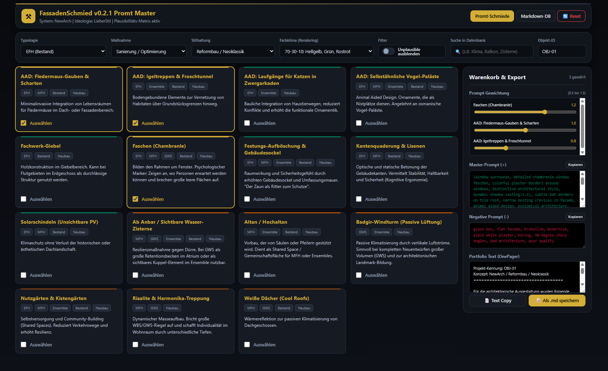

# FassadenSchmied – Promt Master ⚒️

> **Note for English speakers:** This repository and the tool itself are currently available in German only. It is a highly specialized architectural prompt-engineering tool. Please use your browser's built-in translation feature if you wish to read the documentation or use the interface.

**[🚀 Live-Demo im Browser starten](https://fassadenschmied.de/promtmaster.html)**

## Über das Projekt

Der **FassadenSchmied Promt Master** ist ein leichtgewichtiges, komplett offline-fähiges Browser-Tool für Architekten, Designer und Konzeptkünstler. Es basiert auf dem architektonischen Leitbild der Lieberstil-Methodik – einem Gestaltungsansatz, der kognitive Ergonomie, Alterungsfähigkeit, Klimaresilienz und eine maßstäbliche, tektonisch lesbare Formensprache in den Fokus rückt. Das Tool hilft dabei, **evidenzbasierte und typologisch plausible Bauelemente** für die KI-Bildgenerierung (Stable Diffusion ControlNet, NanoBanana2 etc.) zusammenzustellen.

Der Promt-Master gewährleistet eine hohe architektonische und strukturelle Kohärenz durch eine integrierte Plausibilitäts-Matrix. Es prüft in Echtzeit, ob ein ausgewähltes Bauelement (z.B. ein Badgir-Windturm oder eine Fledermausgaube) statisch, klimatisch und stilistisch logisch zu einem bestimmten Gebäudetyp (z.B. EFH Bestand oder WBS-70 Plattenbau) passt, um rein willkürliche Kombinationen zu vermeiden.

## Kernfunktionen
* **Plausibilitäts-Matrix:** Elemente werden automatisch in *Plausibel (Grün)*, *Grenzfall (Orange)* und *Unplausibel (Rot)* kategorisiert und sortiert.
* **Live-Prompt-Generierung:** Automatische Erstellung des Master-Prompts inklusive Farbklimata und Gewichtungen (0.5 bis 1.5).
* **Integrierte Datenbank:** Die komplette Logik und alle Prompt-Bausteine liegen als leicht lesbares Markdown/YAML-Konstrukt direkt in der HTML und können über das Tool selbst eingesehen und editiert werden.
* **100% Standalone:** Einfach die HTML-Datei im Browser öffnen.

## Nutzung / Installation
Da das Tool komplett auf clientseitigem JavaScript basiert, gibt es keine Installation.
1. Einfach die **[Web-Version](https://fassadenschmied.de/promtmaster.html)** nutzen.
2. Oder: Das aktuelle Release herunterladen.
3. Per Doppelklick in einem beliebigen modernen Webbrowser öffnen.

## Lizenz
Dieses Projekt steht unter der **MIT-Lizenz** mit Namensnennung. Du darfst den Code frei verwenden, verändern und kommerziell nutzen, solange der ursprüngliche Urheber (Maximilian Georg Liebscher / FassadenSchmied) in der Lizenzdatei und im Code genannt wird. Siehe `LICENSE` für Details.